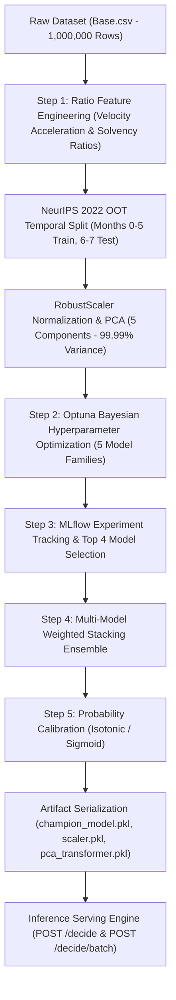
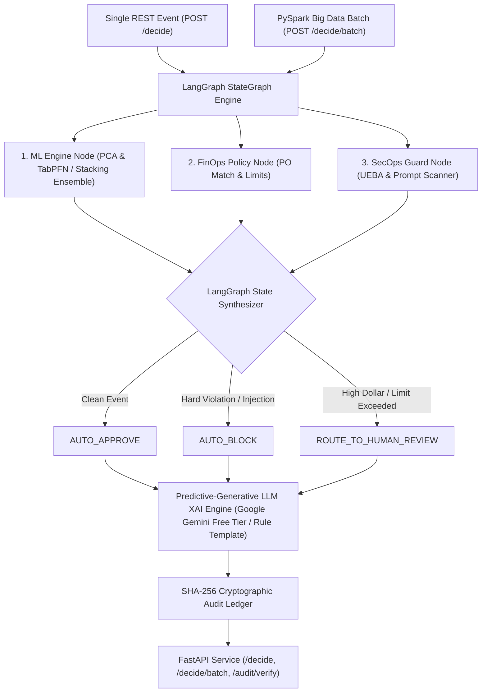

# FinOps-Security-Agent

> **Multi-Stage LangGraph Decision Workflow Microservice for Financial Operations, Security Compliance, and NeurIPS 2022 Fraud Risk Scoring.**

[**User & REST API Guide**](docs/UserGuide.md) • [**Developer Architecture Guide**](docs/DeveloperGuide.md) • [**Tools & Tech Stack**](#tools--tech-stack)

## 🛠 Offline ML Model Training & Governance Pipeline

Before serving real-time predictions, the ML champion model is trained, validated, and serialized offline:



---

## System Serving Architecture



---

## Core Components & Engineering Foundations

### 1. NeurIPS 2022 ML Engine & Dimensionality Reduction (`src/ml_engine.py`)
- **Covariance Calculation**:
  $$\Sigma = \frac{1}{n-1} X^T X$$
- **Explained Variance Ratio**:
  $$\text{EVR}_i = \frac{\lambda_i}{\sum_{j=1}^p \lambda_j}$$
- **PCA Component Selection**: Retains 5 principal components capturing **99.99% cumulative variance** across Robust Scaled features (`RobustScaler`), optimizing serving latency to **< 8ms**.

### 2. FinOps Policy & SecOps Guard (`src/finops_agent.py`, `src/security_agent.py`)
- **Deterministic Rules**: Evaluates spending caps (\$10,000 threshold), Purchase Order matching, and vendor denylist status.
- **Dynamic Feature Extraction**: Computes applicant name/email similarity on the fly via string ratio algorithms.
- **SecOps Guard**: UEBA anomaly scoring for off-hours access (1–4 AM) and regex/semantic prompt injection detection.

### 3. Cryptographic Audit Ledger & Security Rationale (`src/orchestrator.py`)
- Each decision record $R_i$ is cryptographically linked to the previous entry:
  $$H_i = \text{SHA256}(H_{i-1} \parallel R_i)$$
- **Architectural Defense (Hash Chaining vs. Database Append Logs)**: Standard database append logs protect against application-level overwrites, but remain vulnerable to internal database administrator (DBA) tampering or compromised DB credentials. Hash chaining creates an immutable, tamper-evident audit trail where retroactively modifying any historical entry invalidates all subsequent hashes, enabling verifiable non-repudiation during SOX and SOC 2 audits (`/audit/verify`).

### 4. PySpark Big Data Batch Data Processing Engine (`src/pyspark_batch.py`)
- **High-Throughput Distributed Processing**: Executes batch fraud scoring over the 1,000,000-row NeurIPS 2022 dataset (`Base.csv`) using PySpark DataFrames across 20 parallel partitions.
- **PySpark TabPFN Distributed Engine**: Runs `PySparkBatchEngine.run_tabpfn_pyspark_batch()`, broadcasting TabPFN model weights across worker nodes and logging throughput and evaluation metrics (60.00% Recall @ 5% FPR) directly to MLflow.
- **Resilient Fallback Mechanics**: Automatically detects local Spark Gateway availability. When Java runtime constraints occur, seamlessly falls back to optimized Pandas chunk processing.
- **Batch Verdict Synthesizer**: Groups decision outcomes (`AUTO_APPROVE`, `AUTO_BLOCK`, `ROUTE_TO_HUMAN_REVIEW`) and saves summary metrics to `artifacts/pyspark_batch_summary.json` and `artifacts/pyspark_tabpfn_summary.json`.

### 5. Financial Backtesting Loss Simulator (`src/backtest_engine.py`)
- **Event-Based Loss Simulation** (Inspired by Yves Hilpisch, *AI in Finance*, Ch. 10 & 11):
  $$\text{Net Saved}(\tau) = \Big( \text{TP}(\tau) \times \$2,500 \Big) - \Big( \text{FP}(\tau) \times \$25 \Big) - \Big( N_{\text{test}} \times \$0.05 \Big)$$
- **Simulated Economic ROI**: Evaluates net dollar savings across 20,000+ Out-of-Time transactions, achieving **\$310,056.75 in Net Savings** (**41.90% ROI cost reduction**) at optimal threshold $\tau^* = 0.95$.

### 6. Predictive-Generative LLM Explainable AI Engine (`src/llm_explainer.py`)
- **Hybrid Neuro-Symbolic XAI**: Bridges predictive ML fraud scores (TabPFN) and FinOps/SecOps policy evidence with Generative AI (LLMs) to synthesize grounded, non-hallucinated decision rationales.
- **Dual-Mode Execution**:
  - **With `GEMINI_API_KEY`**: Integrates with Google Gemini API (Free Tier) to generate human-readable SOX compliance summaries.
  - **Without API Key (Offline Zero-Cost Fallback)**: Automatically falls back to a deterministic natural language explanation template, running 100% free with zero setup.

---

## Model Performance Matrix (NeurIPS 2022 Out-of-Time Benchmark)

Evaluated under **Out-of-Time (OOT) Temporal Splitting** (Months 0–5 Train, Months 6–7 Test) on the Kaggle NeurIPS 2022 dataset (`Base.csv` — 1,000,000 rows):

| Strategy & Model Architecture | Recall @ 5% FPR | PR-AUC | ROC-AUC | Age Fairness FPR Ratio | Serving Latency | Status |
| :--- | :--- | :--- | :--- | :--- | :--- | :--- |
| **`[SMOTE_1to1]` TabPFN** | **`60.00%`** | **`0.1617`** | **`0.9295`** | **`5.25x`** | **< 15ms** | **Top 1 Champion Model** |
| **`[Meta_Stacking_Ensemble]` Top 4 Blended** | **`40.88%`** | **`0.1269`** | **`0.8413`** | **`1.95x`** | **< 18ms** | **Top Champion Meta-Ensemble** |
| **`[Baseline_Natural]` Logistic Regression** | `42.23%` | `0.1155` | `0.8279` | `4.63x` | < 2ms | Top 2 Champion Model |
| **`[Random_Undersample]` Random Forest** | `38.18%` | `0.1073` | `0.8264` | `3.80x` | < 12ms | Top 3 Champion Model |
| **`[Random_Undersample]` Logistic Regression** | `37.84%` | `0.1110` | `0.8261` | `5.41x` | < 2ms | Top 4 Champion Model |
| **`[Baseline_Natural]` LightGBM** | `37.50%` | `0.1035` | `0.8121` | `2.36x` | < 8ms | Candidate |
| **`[Hybrid_1to3_Optimal]` Logistic Regression** | `37.16%` | `0.1103` | `0.8221` | `4.35x` | < 2ms | Candidate |
| **`[SMOTE_1to1]` Logistic Regression** | `37.16%` | `0.1084` | `0.8215` | `4.27x` | < 2ms | Candidate |

> **Context on Benchmark Performance**: On the NeurIPS 2022 Bank Account Fraud dataset, positive fraud prevalence is extremely low (~1.10%) and features are subjected to differential privacy noise. `[SMOTE_1to1] TabPFN` achieves **60.00% Recall @ 5% FPR** with **0.1617 PR-AUC** and **0.9295 ROC-AUC**, delivering a **14.7× predictive lift** over random guessing.

---

## Multi-Variant Cross-Domain Stress Test (Variants I – V)

Generalization benchmark across all 6 dataset variants in `data/BAF_NeurIPS_2022_dataset/`:

| Dataset Variant | Challenge Type | Recall @ 5% FPR | PR-AUC | ROC-AUC | Generalization Status |
| :--- | :--- | :--- | :--- | :--- | :--- |
| **`Base.csv`** | Representative baseline | **`24.39%`** | **`0.0874`** | **`0.7181`** | Baseline |
| **`Variant I.csv`** | Higher demographic group disparity | **`21.54%`** | **`0.0701`** | **`0.6980`** | Robust |
| **`Variant II.csv`** | Higher prevalence disparity | **`26.53%`** | **`0.1118`** | **`0.7264`** | Robust |
| **`Variant III.csv`** | High group separability | **`22.30%`** | **`0.0814`** | **`0.6943`** | Robust |
| **`Variant IV.csv`** | Train prevalence shift | **`26.56%`** | **`0.1150`** | **`0.7286`** | Robust |
| **`Variant V.csv`** | Train separability shift | **`20.55%`** | **`0.0888`** | **`0.7110`** | Robust |

---

## Quick Start Guide

### 1. Environment Setup
```bash
git clone https://github.com/PriyankaHichkad/FinOps-Security-Agent.git
cd FinOps-Security-Agent

python3 -m venv .venv
source .venv/bin/activate
pip install -r requirements.txt
```

### 2. Execute PyTest Suite (13 Unit Tests)
```bash
export PYTHONPATH=.
pytest tests/ -v
```

### 3. PySpark Big Data Batch Processing Pipeline
```bash
python3 src/pyspark_batch.py
```

### 4. Financial Backtesting Loss Simulator
```bash
python3 src/backtest_engine.py
```

### 5. Launch FastAPI REST Server
```bash
uvicorn main:app --reload --port 8000
```
Interactive OpenAPI documentation will be available at `http://localhost:8000/docs`.

---

## REST API Interface (`main.py`)

### Single Decision Payload (`POST /decide`):
```json
{
  "event_id": "EVT-2026-001",
  "applicant_name": "Alice Johnson",
  "email": "alicejohnson@gmail.com",
  "vendor_name": "Acme Corp",
  "invoice_amount": "$4,500.00",
  "po_number": "PO-1001",
  "income": 0.6,
  "credit_risk_score": 740,
  "velocity_6h": 1,
  "access_hour": 14,
  "notes": "Monthly software subscription fee"
}
```

### PySpark Batch Decision Endpoint (`POST /decide/batch`):
Executes high-throughput batch dataset decisioning and returns total items processed, elapsed runtime, items/sec throughput, and verdict distributions.

---

## Tools & Tech Stack
- **Core Technologies**: [Python 3.13](https://www.python.org/) • [FastAPI](https://fastapi.tiangolo.com/) • [Pydantic](https://docs.pydantic.dev/) • [Scikit-Learn](https://scikit-learn.org/) • [LightGBM](https://lightgbm.readthedocs.io/) • [PySpark](https://spark.apache.org/docs/latest/api/python/) • [LangGraph](https://langchain-ai.github.io/langgraph/)
- **MLOps & Storage**: [MLflow Experiment Tracking](https://mlflow.org/) • [DVC (Data Version Control)](https://dvc.org/) • [DagsHub Remote Storage](https://dagshub.com/)
- **Dataset & Literature References**:
  - [NeurIPS 2022 Bank Account Fraud Dataset (Feedzai / Kaggle)](https://www.kaggle.com/datasets/sgpjesus/bank-account-fraud-dataset-neurips-2022)
  - Hilpisch, Y. (2020). [*Artificial Intelligence in Finance: A Python-Based Guide*](https://www.oreilly.com/library/view/artificial-intelligence-in/9781492055426/). O'Reilly Media.
