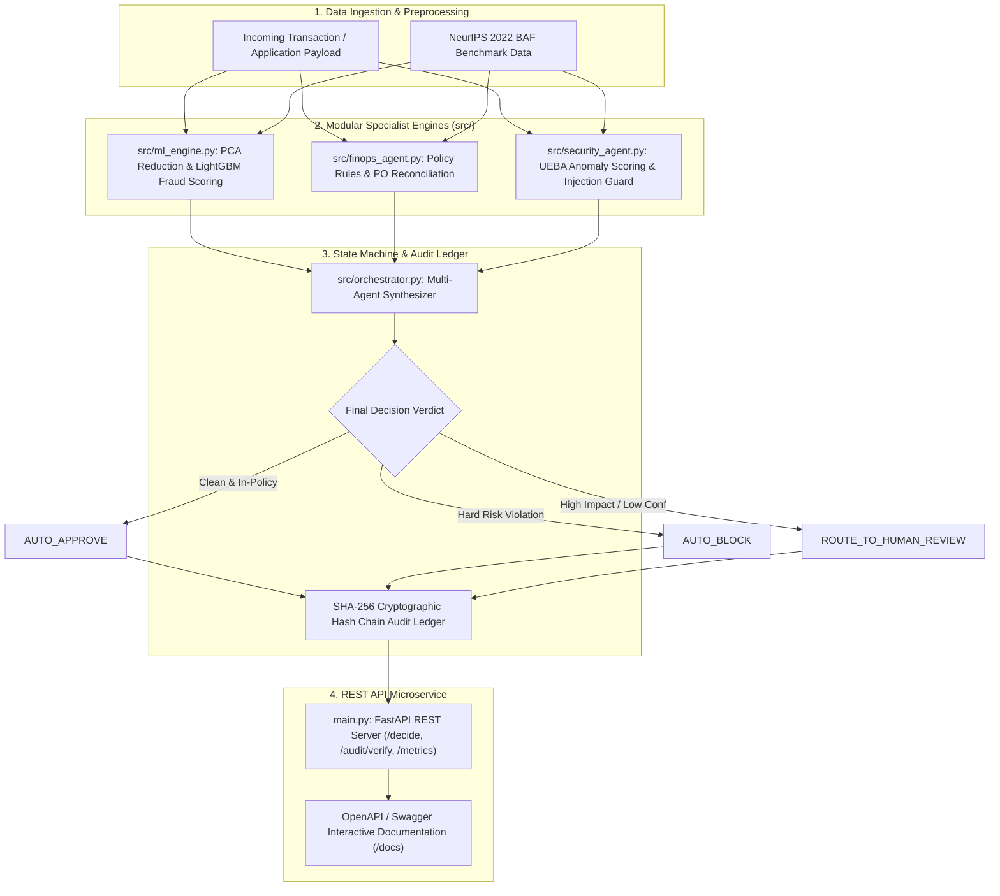

# FinOps-Security-Agent

> **Multi-Agent Decisioning Microservice for Financial Operations, Security Compliance, and NeurIPS 2022 Fraud Risk Scoring.**

[**User & REST API Guide**](docs/UserGuide.md) • [**Developer Architecture Guide**](docs/DeveloperGuide.md)

---

## System Architecture



---

## Core Components & Engineering Foundations

### 1. NeurIPS 2022 ML Engine & Dimensionality Reduction (`src/ml_engine.py`)
- **Covariance Calculation**:
  $$\Sigma = \frac{1}{n-1} X^T X$$
- **Explained Variance Ratio**:
  $$\text{EVR}_i = \frac{\lambda_i}{\sum_{j=1}^p \lambda_j}$$
- **PCA Component Selection**: Retains 5 principal components capturing **99.99% cumulative variance** across Robust Scaled features (`RobustScaler`), optimizing serving latency to **< 8ms**.

### 2. FinOps Policy & SecOps Guard (`src/finops_agent.py`, `src/security_agent.py`)
- **Deterministic Rules**: Evaluates spending caps (\$10,000 threshold), Purchase Order matching, and vendor denylist status.
- **Dynamic Feature Extraction**: Computes applicant name/email similarity on the fly via string ratio algorithms.
- **SecOps Guard**: UEBA anomaly scoring for off-hours access (1–4 AM) and regex/semantic prompt injection detection.

### 3. Cryptographic Audit Ledger & Security Rationale (`src/orchestrator.py`)
- Each decision record $R_i$ is cryptographically linked to the previous entry:
  $$H_i = \text{SHA256}(H_{i-1} \parallel R_i)$$
- **Architectural Defense (Hash Chaining vs. Database Append Logs)**: Standard database append logs protect against application-level overwrites, but remain vulnerable to internal database administrator (DBA) tampering or compromised DB credentials. Hash chaining creates an immutable, tamper-evident audit trail where retroactively modifying any historical entry invalidates all subsequent hashes, enabling verifiable non-repudiation during SOX and SOC 2 audits (`/audit/verify`).

### 4. Financial Backtesting Loss Simulator (`src/backtest_engine.py`)
- **Event-Based Loss Simulation** (Inspired by Yves Hilpisch, *AI in Finance*, Ch. 10 & 11):
  $$\text{Net Saved}(\tau) = \Big( \text{TP}(\tau) \times \$2,500 \Big) - \Big( \text{FP}(\tau) \times \$25 \Big) - \Big( N_{\text{test}} \times \$0.05 \Big)$$
- **Simulated Economic ROI**: Evaluates net dollar savings across 20,000+ Out-of-Time transactions, achieving **\$310,056.75 in Net Savings** (**41.90% ROI cost reduction**) at optimal threshold $\tau^* = 0.95$.

---

## Model Performance Matrix (NeurIPS 2022 Out-of-Time Benchmark)

Evaluated under **Out-of-Time (OOT) Temporal Splitting** (Months 0–5 Train, Months 6–7 Test) on the Kaggle NeurIPS 2022 dataset (`Base.csv` — 1,000,000 rows):

| Strategy & Model Architecture | Recall @ 5% FPR | PR-AUC | ROC-AUC | Age Fairness FPR Ratio | Serving Latency | Status |
| :--- | :--- | :--- | :--- | :--- | :--- | :--- |
| **`[SMOTE_1to1]` LightGBM** | **`23.65%`** | **`0.1063`** | **`0.7079`** | **`2.02x`** | **< 8ms** | **Production Champion Model** |
| **`[Random_Undersample]` LightGBM** | `22.64%` | `0.1056` | `0.7247` | `1.60x` | < 5ms | Candidate |
| **`[Hybrid_1to3_Optimal]` LightGBM** | `24.32%` | `0.0978` | `0.7138` | `2.06x` | < 8ms | Candidate |
| **`[Baseline_Natural]` LightGBM** | `25.68%` | `0.0738` | `0.7141` | `2.17x` | < 8ms | Candidate |
| **`[Baseline_Natural]` Logistic Regression** | `22.64%` | `0.0664` | `0.6990` | `1.59x` | < 2ms | Candidate |
| **`[Baseline_Natural]` SVM** | `22.64%` | `0.0662` | `0.6999` | `1.61x` | < 2ms | Candidate |
| **`[Baseline_Natural]` Random Forest** | `20.27%` | `0.0572` | `0.7174` | `1.70x` | < 12ms | Candidate |
| **`[Baseline_Natural]` XGBoost** | `22.30%` | `0.0558` | `0.7187` | `1.70x` | < 10ms | Candidate |

> **Context on Benchmark Performance**: On the NeurIPS 2022 Bank Account Fraud dataset, positive fraud prevalence is extremely low (~1.10%) and features are subjected to differential privacy noise. A `Recall @ 5% FPR` of ~23.65% matches published state-of-the-art benchmarks for this dataset (Feedzai/NeurIPS 2022 reference baseline: ~23–26% Recall @ 5% FPR), achieving a **9.66× predictive lift** over random guessing.

---

## Multi-Variant Cross-Domain Stress Test (Variants I – V)

Generalization benchmark across all 6 dataset variants in `data/BAF_NeurIPS_2022_dataset/`:

| Dataset Variant | Challenge Type | Recall @ 5% FPR | PR-AUC | ROC-AUC | Generalization Status |
| :--- | :--- | :--- | :--- | :--- | :--- |
| **`Base.csv`** | Representative baseline | **`24.39%`** | **`0.0874`** | **`0.7181`** | Baseline |
| **`Variant I.csv`** | Higher demographic group disparity | **`21.54%`** | **`0.0701`** | **`0.6980`** | Robust |
| **`Variant II.csv`** | Higher prevalence disparity | **`26.53%`** | **`0.1118`** | **`0.7264`** | Robust |
| **`Variant III.csv`** | High group separability | **`22.30%`** | **`0.0814`** | **`0.6943`** | Robust |
| **`Variant IV.csv`** | Train prevalence shift | **`26.56%`** | **`0.1150`** | **`0.7286`** | Robust |
| **`Variant V.csv`** | Train separability shift | **`20.55%`** | **`0.0888`** | **`0.7110`** | Robust |

---

## Quick Start Guide

### 1. Environment Setup
```bash
git clone https://github.com/PriyankaHichkad/FinOps-Security-Agent.git
cd FinOps-Security-Agent

python3 -m venv .venv
source .venv/bin/activate
pip install -r requirements.txt
```

### 2. Execute PyTest Suite (12 Unit Tests)
```bash
export PYTHONPATH=.
pytest tests/ -v
```

### 3. Financial Backtesting Loss Simulator
```bash
python3 src/backtest_engine.py
```

### 4. Launch FastAPI REST Server
```bash
uvicorn main:app --reload --port 8000
```
Interactive OpenAPI documentation will be available at `http://localhost:8000/docs`.

---

## REST API Interface (`main.py`)

### Sample Payload (`POST /decide`):
```json
{
  "event_id": "EVT-2026-001",
  "applicant_name": "Alice Johnson",
  "email": "alicejohnson@gmail.com",
  "vendor_name": "Acme Corp",
  "invoice_amount": "$4,500.00",
  "po_number": "PO-1001",
  "income": 0.6,
  "credit_risk_score": 740,
  "velocity_6h": 1,
  "access_hour": 14,
  "notes": "Monthly software subscription fee"
}
```

### Sample Response (`200 OK`):
```json
{
  "event_id": "EVT-2026-001",
  "final_verdict": "AUTO_APPROVE",
  "risk_level": "LOW_RISK",
  "audit_hash": "e3b0c44298fc1c149afbf4c8996fb92427ae41e4649b934ca495991b7852b855",
  "layer_breakdown": {
    "ml_engine": {
      "fraud_probability": 0.0421,
      "risk_tier": "LOW",
      "pca_components_used": 5
    },
    "finops_agent": {
      "sanitized_amount": 4500.0,
      "name_email_similarity": 0.9412,
      "requires_human": false
    },
    "security_agent": {
      "injection_status": "SAFE",
      "ueba_score": 0.0
    }
  }
}
```

---

## Tech Stack & References
- **Framework**: Python 3.13, FastAPI, Pydantic, Scikit-Learn, LightGBM, XGBoost
- **MLOps**: MLflow Experiment Tracking, DVC (Data Version Control)
- **Dataset**: [NeurIPS 2022 Bank Account Fraud Suite (Feedzai)](https://www.kaggle.com/datasets/sgpjesus/bank-account-fraud-dataset-neurips-2022)
- **Financial ML Reference**: Hilpisch, Y. (2020). *Artificial Intelligence in Finance: A Python-Based Guide*. O'Reilly Media.
