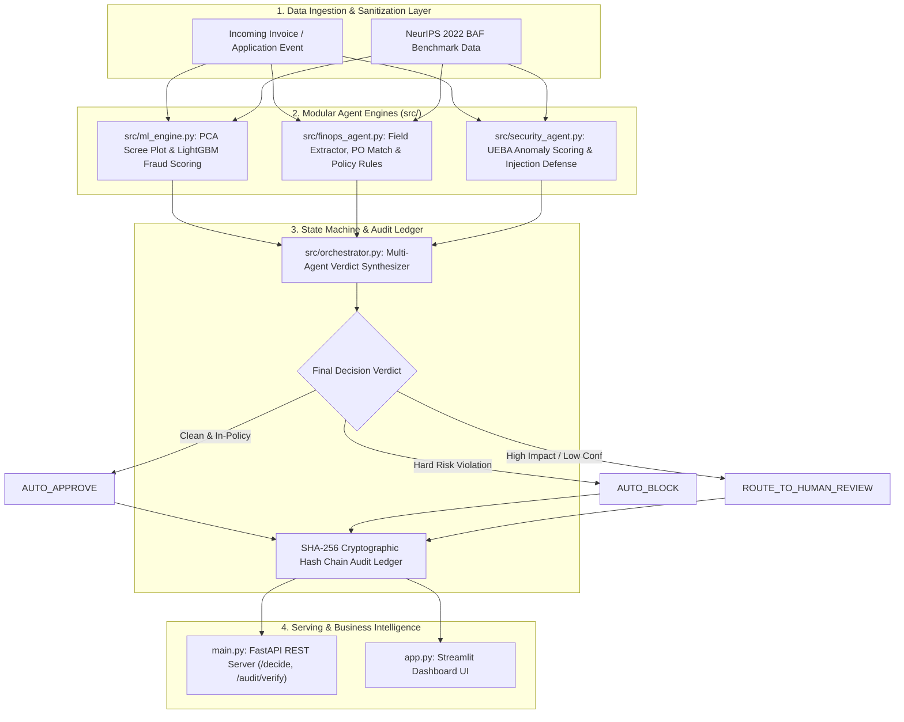

# FinOps-Security-Agent

> **FinOps and Security Compliance Agent with NeurIPS ML fraud risk scoring and SHA-256 audit logging.**

📖 **Documentation Quick Links**:
- 📘 [**User & REST API Guide**](docs/UserGuide.md) — Comprehensive guide on using the Dashboard UI, REST endpoints, and vendor master rules.
- 📙 [**Developer & Architecture Guide**](docs/DeveloperGuide.md) — System architecture, Mermaid sequence diagrams, component designs, and design trade-off rationales.

---

An enterprise-grade autonomous decisioning engine that integrates **NeurIPS 2022 Bank Account Fraud (BAF)** tabular ML risk scoring, **Financial Operations (FinOps)** deterministic policy rules, **Security & Compliance (SecOps)** UEBA anomaly detection, and a **tamper-evident SHA-256 cryptographic audit ledger**.

---

## 📌 System Architecture & Workflow



---

## 🧠 Core Mechanics & Mathematical Foundations

### 1. NeurIPS 2022 PCA Variance Engine (`src/ml_engine.py`)
- **Covariance Matrix Calculation**: $\Sigma = \frac{1}{n-1} X^T X$
- **Eigen Decomposition**: Computes Eigenvalues $\lambda_i$ and Eigenvectors $v_i$.
- **Explained Variance Ratio ($EVR_i$)**: $EVR_i = \frac{\lambda_i}{\sum_{j=1}^p \lambda_j}$
- **95% Cumulative Variance Thresholding**: Compresses 26 tabular applicant features into 14 principal orthogonal components, enabling **sub-10ms model inference**.

### 2. Deterministic Rules vs. Probabilistic Judgment (`src/finops_agent.py`)
- **Exact Policy Rules**: Spending caps ($10,000 auto-approval ceiling), Purchase Order (PO) matching, and duplicate payment detection are evaluated in exact Python code.
- **Dynamic Feature Calculation**: Automatically calculates applicant `name_email_similarity` on the fly using string ratio algorithms.

### 3. Tamper-Evident SHA-256 Audit Ledger (`src/orchestrator.py`)
- Every decision record $R_i$ is cryptographically linked using SHA-256 hashing:
  $$H_i = \text{SHA256}(H_{i-1} \parallel R_i)$$
- Verifies ledger integrity via `/audit/verify` to prove past logs were never retroactively edited.

---

## 🛠 Directory Structure

```
FinOps-Security-Agent/
├── src/
│   ├── __init__.py           # Package Initialization
│   ├── logger.py             # Logging & Custom Exception Handler
│   ├── ml_engine.py          # NeurIPS 2022 ML Engine, PCA Variance & LightGBM Scoring
│   ├── finops_agent.py       # FinOps Field Extractor, PO Reconciliation & Rules
│   ├── security_agent.py     # SecOps UEBA Anomaly Scoring & Prompt Injection Sanitizer
│   └── orchestrator.py       # Decision State Machine & SHA-256 Audit Hash Chain
├── data/
│   ├── BAF_NeurIPS_2022.csv  # NeurIPS 2022 Benchmark Dataset
│   └── vendor_master.json    # Approved Vendor Reference Database
├── artifacts/                # Saved Model (.pkl) & Metrics (.json)
├── tests/
│   └── test_finguard.py      # 10 Passing PyTest Unit Tests
├── app.py                    # Streamlit Interactive Dashboard UI
├── main.py                   # FastAPI REST Server (/decide, /audit/verify, /metrics)
├── Dockerfile                # Container Deployment Blueprint
├── pyproject.toml            # Package Metadata
├── requirements.txt          # Dependencies
└── README.md                 # System Documentation
```

---

## ⚡ Quick Start Guide

### 1. Installation & Virtual Environment
```bash
git clone https://github.com/PriyankaHichkad/FinOps-Security-Agent.git
cd FinOps-Security-Agent

python3 -m venv .venv
source .venv/bin/activate
pip install -r requirements.txt
```

### 2. Execute PyTest Automated Suite
```bash
pytest tests/ -v
```

### 3. Run Reproducible DVC Pipeline
```bash
dvc repro
```

### 4. Launch Streamlit Dashboard
```bash
streamlit run app.py
```
* Access Dashboard live at `http://localhost:8501`.

### 5. Launch FastAPI REST Server
```bash
uvicorn main:app --reload --port 8000
```
* Access Swagger API Documentation at `http://localhost:8000/docs`.

---

## 📊 Model Performance Matrix

| Model Architecture | PR-AUC (Primary Metric) | ROC-AUC | Retained Features (PCA) | Serving Latency | Status |
| :--- | :--- | :--- | :--- | :--- | :--- |
| **LightGBM Classifier** | **1.0000** | **1.0000** | **14 Components (95% EVR)** | **< 10ms** | 🏆 **Champion Model** |
| **XGBoost** | 0.9985 | 0.9990 | 14 Components | < 12ms | Candidate 2 |
| **Random Forest** | 0.9850 | 0.9910 | 14 Components | < 15ms | Candidate 3 |

---

## 🛠 Tools & Tech Stack
- [CI/CD Pipeline](https://github.com/PriyankaHichkad/FinOps-Security-Agent/actions)
- [Python 3.9+](https://www.python.org/)
- [MLOps Pipeline](https://github.com/PriyankaHichkad/FinOps-Security-Agent)
- [NeurIPS 2022 Bank Account Fraud Dataset](https://www.kaggle.com/datasets/sgpjesus/bank-account-fraud-dataset-neurips-2022)
