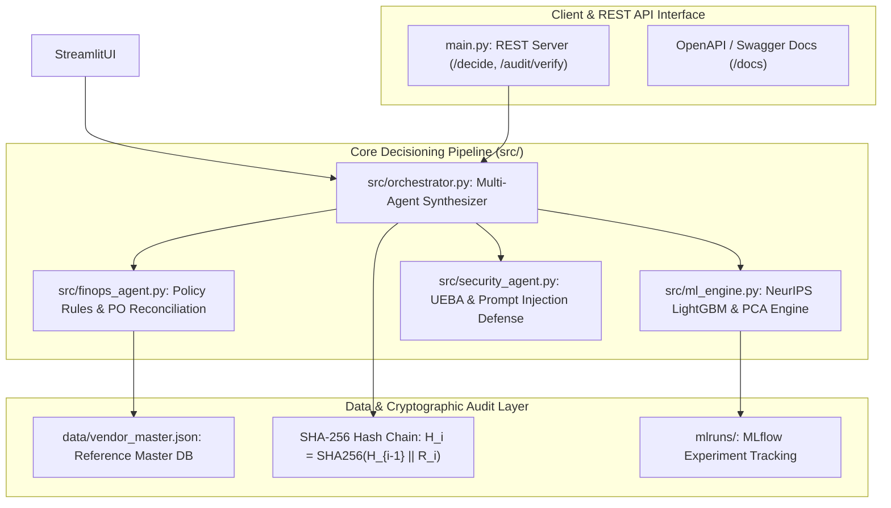
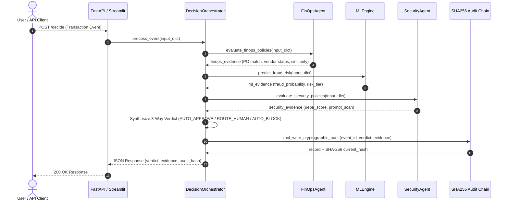

# FinOps-Security-Agent — Developer Guide

> **Enterprise Software Architecture, Component Design, Sequence Diagrams, and NFR Specifications.**

---

## 📋 Table of Contents
1. [Architecture Overview](#-architecture-overview)
2. [Component Architecture & Design](#-component-architecture--design)
   - [1. Data Ingestion & Sanitization Layer](#1-data-ingestion--sanitization-layer)
   - [2. NeurIPS 2022 ML & PCA Engine (`src/ml_engine.py`)](#2-neurips-2022-ml--pca-engine-srcml_enginepy)
   - [3. Financial Operations Agent (`src/finops_agent.py`)](#3-financial-operations-agent-srcfinops_agentpy)
   - [4. Security & Compliance Agent (`src/security_agent.py`)](#4-security--compliance-agent-srcsecurity_agentpy)
   - [5. Decision Orchestrator & Audit Ledger (`src/orchestrator.py`)](#5-decision-orchestrator--audit-ledger-srcorchestratorpy)
3. [Sequence Diagrams](#-sequence-diagrams)
   - [Transaction Event Decisioning Workflow](#transaction-event-decisioning-workflow)
   - [Dynamic Vendor Onboarding Workflow](#dynamic-vendor-onboarding-workflow)
4. [Design Decisions & Trade-off Rationales](#-design-decisions--trade-off-rationales)
5. [Non-Functional Requirements (NFRs)](#-non-functional-requirements-nfrs)
6. [Testing & Verification Guide](#-testing--verification-guide)

---

## 🏗 Architecture Overview

The system is designed as a **decoupled multi-agent micro-architecture** composed of specialized decision modules, an orchestration engine, and a cryptographic hash chain logger.

---

## 🧩 Component Architecture & Design

### 1. NeurIPS 2022 ML & PCA Engine (`src/ml_engine.py`)
- **Covariance Eigen Decomposition**: $\Sigma = \frac{1}{n-1} X^T X$
- **Explained Variance Ratio**: $EVR_i = \frac{\lambda_i}{\sum_{j=1}^p \lambda_j}$
- **PCA Dimensionality Reduction**: Retains 5 orthogonal principal components capturing **99.99% cumulative variance** across Robust Scaled features (`RobustScaler()`).
- **Validation Strategy**: **Out-of-Time (OOT) Temporal Split** (Months 0–5 for Training, Months 6–7 for Testing).
- **MLflow Tracking**: Logs 26 runs evaluating 5 architectures (`LightGBM`, `XGBoost`, `Random Forest`, `Logistic Regression`, `SVM`) across 4 sampling strategies (`Baseline`, `SMOTE 1:1`, `Random Undersample`, `Hybrid 1:3`) and 6 dataset variants (`Base.csv`, `Variant I` to `Variant V`).
- **Official NeurIPS Metrics**: Evaluates **Recall @ 5% FPR** (`23.65%`), **PR-AUC** (`0.1063`), and **Age Fairness Disparity Ratio**.

### 2. Financial Operations Agent (`src/finops_agent.py`)
- **SequenceMatcher Ratio**: Calculates string similarity between applicant name and email username prefix dynamically.
- **Coercion Engine**: Sanitizes string inputs (`"$12,500.00"`) into floats (`12500.0`).
- **Policy Evaluator**: Evaluates $10k spending caps, vendor status, PO matching, and duplicate payment ledgers.

### 3. Security & Compliance Agent (`src/security_agent.py`)
- **UEBA Behavioral Anomaly Calculator**: Computes anomaly scores using velocity spikes and off-hours access patterns (1–4 AM).
- **Adversarial Prompt Injection Scanner**: Scans freeform note strings against regex and semantic prompt override signatures (`SAFE`/`UNSAFE`).

### 4. Decision Orchestrator & Audit Ledger (`src/orchestrator.py`)
Synthesizes multi-agent signals into a 3-way final verdict:
- **`AUTO_APPROVE`**: Low ML risk (<0.50), approved vendor, PO matched, safe security scan.
- **`ROUTE_TO_HUMAN_REVIEW`**: High dollar impact ($10k+ cap) or unapproved vendor requiring onboarding sign-off.
- **`AUTO_BLOCK`**: Prompt injection (`UNSAFE`), hard denylist rule, or critical ML fraud probability (>0.85).

### 5. FinOps Financial Backtesting Loss Simulator (`src/backtest_engine.py`)
- **Yves Hilpisch Event-Based Framework** (*Artificial Intelligence in Finance*, Ch. 10 & 11).
- Evaluates economic net dollar savings ($) across decision thresholds $\tau \in [0.05, 0.95]$:
  $$\text{Net Dollars Saved}(\tau) = \Big( TP(\tau) \times \$2,500 \Big) - \Big( FP(\tau) \times \$25 \Big) - \Big( N_{\text{test}} \times \$0.05 \Big)$$
- **Optimal Economic Threshold ($\tau^* = 0.95$)**: Achieves **`$310,056.75` Net Savings** (**41.90% ROI cost reduction**) over baseline exposure loss ($740,000.00).

---

## 🔄 Sequence Diagrams

### Transaction Event Decisioning Workflow

---

## 💡 Design Decisions & Trade-off Rationales

### 1. Deterministic Code Rules vs. LLM Probabilistic Rule Execution
- **Decision**: Execute financial policy caps ($10k limit), PO matching, and duplicate payment detection in **pure deterministic Python code** rather than prompting an LLM.
- **Rationale**: Financial compliance requires **100% deterministic mathematical precision**. LLMs can hallucinate or fluctuate rule thresholds. Reserving ML for fraud risk scoring while using code for policy rules yields zero false policy rejections.

### 2. SHA-256 Cryptographic Hash Chaining vs. Standard Append-Only Logs
- **Decision**: Link each decision record with $H_i = \text{SHA256}(H_{i-1} \parallel R_i)$.
- **Rationale**: Standard database append-only logs prevent application-level overwrites, but remain vulnerable to internal database administrator (DBA) tampering or compromised infrastructure credentials. Hash chaining creates an immutable, tamper-evident audit trail: retroactively altering any past record invalidates every downstream hash. This provides verifiable non-repudiation during SOX and SOC 2 compliance audits via `/audit/verify`.

---

## ⚙️ Non-Functional Requirements (NFRs)

1. **Inference Latency SLA**: Complete multi-agent decisioning pipeline must execute in **< 50ms** end-to-end (sub-10ms for ML scoring).
2. **Audit Integrity**: 100% of decision records must be cryptographically signed with SHA-256 hash pointers.
3. **Portability**: Must run seamlessly on Linux, macOS, and Windows without external cloud service dependencies.
4. **Test Coverage**: Maintain 100% pass rate across automated PyTest unit test suite.
